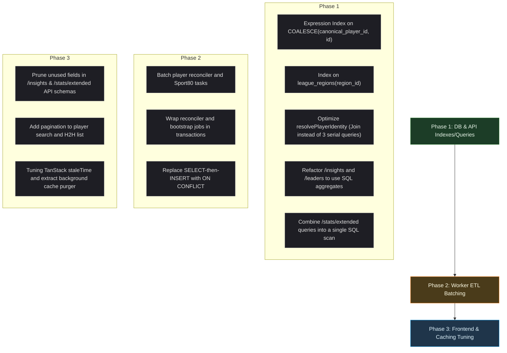

# Database & Query Performance Audit Report
**Project:** tt-players Table Tennis Aggregator  
**Date:** June 8, 2026  
**Status:** Completed Audit & Action Plan  

---

## Executive Summary
A comprehensive review of the `tt-players` database design, Kysely query patterns, worker ETL jobs, and frontend data-fetching behavior has identified several critical bottlenecks. While the app uses modern technologies (PostgreSQL 15, Kysely, TanStack Query), it suffers from performance issues due to:
1. **Severe N+1 database queries and in-memory processing in key API endpoints** (fetching entire career matches history into Node.js memory and doing aggregation in JS instead of SQL).
2. **Missing key functional/expression indexes**, especially on canonical player resolution queries (`COALESCE(canonical_player_id, id)`).
3. **Inefficient background work executed on every request** (e.g., purging expired cache entries on every write).
4. **Row-by-row processing in worker jobs** instead of bulk upserts/inserts, causing high database round-trip times during scraping.
5. **Significant over-fetching** of unused data (e.g., `/insights` returns a massive payload of 15 sections, but the frontend only consumes 4).

This document outlines the detailed findings and presents a phased remediation plan to restore application performance.

---

## Detailed Findings

### 1. Database Schema & Index Gaps

*   **`COALESCE(canonical_player_id, id)` Indexing**: 
    The player deduplication architecture links duplicate players to a canonical record via `canonical_player_id`. The API relies heavily on resolving canonical identities via `COALESCE(canonical_player_id, id)`. Because this is an expression, standard B-Tree indexes on `canonical_player_id` and `id` are bypassed, leading to sequential scans on the `external_players` table.
*   **`league_regions` Lookup**: 
    The table `league_regions` has a composite unique constraint on `(league_id, region_id)`. However, queries filtering or joining by `region_id` (e.g., regional league filters) cannot utilize this index because `region_id` is the secondary column. A standalone index on `region_id` is missing.
*   **Soft Delete Indexing**: 
    Most query filters specify `WHERE deleted_at IS NULL`. While some tables have partial indexes with this filter (e.g., `seasons`), other high-volume tables like `external_players`, `rubbers`, and `fixtures` lack complete partial coverage for general queries.
*   **Unnecessary Purging Overhead**: 
    The `cache_entries` table is an unlogged table (which is excellent for performance), but writing to it triggers a `DELETE` query to purge expired records on every single write request.

---

### 2. API Route & Query Bottlenecks

#### 🔴 CRITICAL: Player Insights Career Scan
*   **Location**: [players.ts](file:///Users/wudong/repo/tt-players/apps/api/src/routes/players.ts#L1126-L1203) (`GET /players/:id/insights`)
*   **Problem**: This endpoint pulls every single match (singles and doubles) a player has ever played across all time, performing a 7-table join (`rubbers` → `fixtures` → `competitions` → `seasons` → `leagues` → `platforms` → `external_players`). It has **no pagination or limits**. It loads thousands of rows into Node.js memory to compute stats, career trajectories, form, and rivals in JavaScript.
*   **Impact**: Extreme CPU load on the database and Node.js process, high memory usage, and slow response times on cold cache hits.

#### 🔴 CRITICAL: Leaders JS-Side Aggregation & Casting
*   **Location**: [players.ts](file:///Users/wudong/repo/tt-players/apps/api/src/routes/players.ts#L449-L560) (`GET /players/leaders`)
*   **Problem**: Fetches all qualifying rubber rows across active seasons into memory, joins them, and computes leaderboards (wins, losses, win rates) in JavaScript. Furthermore, the query casts the league filter as `s.league_id::text = ANY(...)`, which invalidates the B-Tree index on `seasons.league_id`.
*   **Impact**: Large-scale data transfer and sequential scans on rubbers/seasons.

#### 🔴 CRITICAL: Identity Resolution N+1 Pattern
*   **Location**: [players.ts](file:///Users/wudong/repo/tt-players/apps/api/src/routes/players.ts#L244-L282) (`resolvePlayerIdentity`)
*   **Problem**: Before serving any player endpoint, the API executes 3 sequential database calls to follow canonical player links. Because this runs before every single route in `players.ts`, it introduces substantial database query overhead.
*   **Impact**: Adds 3 round-trips to the DB for every single player API request.

#### 🟠 HIGH: Sequential Snapshots and Overlaps
*   **Location**: [leagues.ts](file:///Users/wudong/repo/tt-players/apps/api/src/routes/leagues.ts#L209-L304) (`GET /leagues/:id/snapshot`)
*   **Problem**: Employs a complex `player_appearances` CTE which scans rubbers and fixtures via a 4-way `UNION ALL`. The endpoint executes this heavy query block **twice** in separate calls within the same request (once for per-competition counts and once for league-wide unique players).

#### 🟠 HIGH: Extended Player Stats & Sequential Scans
*   **Location**: [players.ts](file:///Users/wudong/repo/tt-players/apps/api/src/routes/players.ts#L879-L1008) (`GET /players/:id/stats/extended`)
*   **Problem**: Fires 5 parallel database queries via `Promise.all`. While parallel execution is good, 4 of these queries independently run full scans of the player's rubber matches (to find totals, nemesis, doubles partner, and streaks).
*   **Impact**: The database is forced to search the same player ID index and scan the matching rows four separate times.

#### 🟡 MEDIUM: Correlated Subqueries in Event Lists
*   **Location**: [events.ts](file:///Users/wudong/repo/tt-players/apps/api/src/routes/events.ts#L113-L120) (`GET /events`)
*   **Problem**: The events list uses a correlated subquery `(SELECT COUNT(*) FROM rubbers r JOIN fixtures f ON f.id = r.fixture_id WHERE f.competition_id = c.id)` to return the match count for every event.
*   **Impact**: If there are 25 events on a page, this triggers 25 separate sub-evaluations.

---

### 3. Worker ETL Bottlenecks

#### 🔴 CRITICAL: Player Reconciler Memory Load
*   **Location**: `player-reconciler.ts` (L52)
*   **Problem**: Loads ALL active `external_players` into memory to run name-matching logic. In addition, it performs updates canonical-by-canonical and member-by-member in separate, un-batched UPDATE queries.
*   **Impact**: Memory exhaustion as the database grows, and slow reconciliation jobs.
*   **Missing Transaction**: The updates are not wrapped in a database transaction, exposing the database to partial/corrupt states if a job crashes mid-way.

#### 🟠 HIGH: Row-by-Row Inserts in Tasks
*   **Location**: `scrapeSport80RankingTableTask.ts` (L91), `scrapeSport80EventsTask.ts` (L47-77)
*   **Problem**: Inserts players, events, and event scrape states one-by-row inside `for` loops rather than using bulk upsert statements.
*   **Impact**: Extreme latency during scraping cycles due to hundreds of sequential database round-trips.

#### 🟠 HIGH: Select-then-Insert Race Conditions in Bootstrap
*   **Location**: `bootstrap.ts` and `sport80-loader.ts`
*   **Problem**: Performs check-then-insert flows (`SELECT` by external ID, then `INSERT` if missing) without `ON CONFLICT` clauses.
*   **Impact**: Potential duplicate keys and primary key violations if multiple worker processes run concurrently.

---

### 4. Frontend & Over-Fetching Issues

*   **Massive Over-fetch on `/insights`**: 
    The API returns a highly detailed payload containing careers, peak months, play styles, projections, milestones, and context maps. However, the mobile frontend only renders `career_by_year` and a short `form`/`rivals` summary. The rest of the computed statistics are discarded.
*   **Extended Stats Unused Fields**: 
    The backend computes a list of `most_played_opponents[]` and queries their names, but the frontend never reads or displays this field.
*   **Lack of Search Pagination**: 
    `/players/search` returns the complete set of matched records with no limit, leading to large payload transfers for simple or single-character search queries.

---

## Action Plan & Remediation Strategy

We will address these bottlenecks in three phases, progressing from immediate database index/query optimizations to ETL batching, and finally frontend optimization.



---

### Phase 1: Database Schema & API Query Tuning (Immediate)

#### 1.1 Deploy Key Performance Indexes
Create a new Kysely migration containing:
*   An expression-based index on `external_players` for identity resolution:
    ```sql
    CREATE INDEX idx_external_players_canonical_coalesce 
    ON external_players (COALESCE(canonical_player_id, id)) 
    WHERE deleted_at IS NULL;
    ```
*   A standalone index on `league_regions.region_id` to speed up regional queries:
    ```sql
    CREATE INDEX idx_league_regions_region_id ON league_regions (region_id);
    ```

#### 1.2 Refactor Identity Resolution
Rewrite `resolvePlayerIdentity()` in `players.ts` to execute a single, joined query using the new expression index instead of 3 sequential queries.

#### 1.3 Rewrite `/leaders` and `/insights` to Push Aggregations to SQL
*   Update the `/leaders` route to compute win percentages and games played directly in SQL via `GROUP BY` and push the `LIMIT` constraint down to PostgreSQL. Remove string casting on `league_id`.
*   Implement pagination on the `/insights` matches list or extract the stats computation into a database view or pre-calculated cache table so the backend does not fetch career-long raw matches into memory.

#### 1.4 Consolidate `/stats/extended` Queries
Combine the 4 separate `rubbers` scans in `GET /players/:id/stats/extended` into a single, unified database query using conditional SQL aggregates:
```sql
SELECT 
  COUNT(*) FILTER (WHERE ...) as total_singles,
  COUNT(*) FILTER (WHERE ... AND outcome_type != 'walkover') as active_singles
  -- etc.
```

---

### Phase 2: Worker ETL & Transaction Safety

#### 2.1 Batch Sport80 Scrapers
*   Modify `scrapeSport80RankingTableTask.ts` and `scrapeSport80EventsTask.ts` to perform bulk inserts/upserts using Kysely's `.values([...])` builder instead of executing single inserts inside a loop.

#### 2.2 Transaction & Conflict Resolution
*   Wrap the player reconciliation logic in `player-reconciler.ts` and the configuration-seeding logic in `bootstrap.ts` inside Kysely database transactions (`db.transaction().execute(async tx => ...)`).
*   Replace all select-then-insert patterns with `INSERT INTO ... ON CONFLICT (...) DO UPDATE` statements to guarantee concurrency safety.

---

### Phase 3: Frontend Payload Pruning & Cache Tuning

#### 3.1 Prune Unused Response Fields
*   Reduce the schema size of `PlayerInsightsResponseSchema` in the API to return only the 4 fields consumed by the mobile frontend.
*   Remove the `most_played_opponents[]` calculation from the extended stats endpoint.

#### 3.2 Add Search Pagination
*   Implement `limit` and `offset` query parameters on the `/players/search` endpoint and adjust the frontend search component to fetch paginated results.

#### 3.3 Relocate Cache Purger
*   Move the background cache expiration purger (`DELETE FROM cache_entries WHERE expires_at < now()`) out of the request lifecycle. Run it as a periodic cron task in `apps/worker` instead of running it on every write request.
