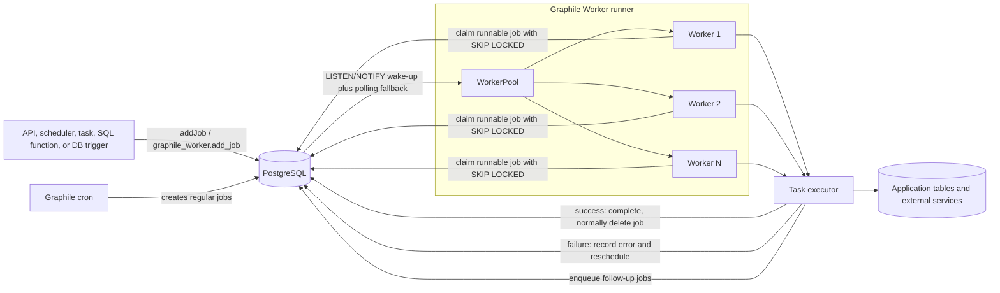

# Graphile Worker: Architecture, Trade-offs, and Use in TT Players

> **Status:** Review document, updated 6 August 2026  
> **Repository context:** `tt-players` currently declares `graphile-worker: ^0.16.6`. The latest npm release at the time of writing is `0.17.3`; the `^0.16.6` range does not automatically cross into `0.17.x`.

## Executive summary

Graphile Worker is a PostgreSQL-backed background job queue for Node.js. Producers insert a small job description into PostgreSQL, worker processes claim runnable jobs, and task executor functions perform the actual work. PostgreSQL supplies durable storage and transactional guarantees; `LISTEN/NOTIFY` provides low-latency wake-ups; `FOR UPDATE SKIP LOCKED` allows multiple workers to safely claim different jobs; and Graphile Worker supplies retries, delayed execution, priorities, cron scheduling, job keys, named queues, and graceful shutdown.

For **TT Players**, Graphile Worker is a very good architectural fit:

- PostgreSQL is already the system of record.
- The workload is asynchronous ETL: scraping, parsing, reconciliation, ratings, cache cleanup, and read-model refreshes.
- Jobs benefit from being created transactionally alongside database changes.
- Most work is I/O-bound rather than CPU-bound.
- External league websites need controlled concurrency and retries rather than maximum raw throughput.
- Keeping scheduling and queueing in PostgreSQL avoids operating Redis, RabbitMQ, or a cloud queue in addition to the existing database.

The main limitations are equally important:

- Delivery is **at least once**, not exactly once. Every task must be idempotent or protect non-repeatable side effects.
- Queue activity adds write churn and contention to the primary PostgreSQL database.
- A hard worker crash may leave jobs locked for hours unless recovery is added.
- Graphile Worker is not a full durable workflow engine.
- Its private tables are not a supported API and may change in minor or patch releases.
- Very high sustained throughput, CPU-heavy processing, or independently scaled queue infrastructure may justify a dedicated system.

**Recommendation for TT Players:** keep Graphile Worker. Treat it as a durable job-dispatch mechanism, not as the source of business workflow state. Continue storing ingestion state, raw payloads, processing status, and idempotency markers in application-owned tables. Address the direct `_private_*` table access in `startup-recovery.ts` before upgrading Graphile Worker.

## 1. What Graphile Worker is

Graphile Worker has four core concepts:

| Concept | Meaning |
| --- | --- |
| **Task** | A type of work, such as `scrapeUrlTask` or `calculateRatingsTask`. |
| **Task identifier** | The stable string that maps a job to a task executor. |
| **Job** | A durable database record describing one execution: task identifier, payload, schedule, attempts, priority, queue, and optional job key. |
| **Task executor** | An async JavaScript or TypeScript function that receives the payload and helpers, performs the work, and either returns or throws. |

A task is code. A job is data describing an invocation of that code.

Graphile Worker can run in:

- **CLI mode**, where task files are discovered from a directory.
- **Library mode**, where an application calls `run(...)` and supplies a `taskList` or task directory.

TT Players uses **library mode** in [`apps/worker/src/worker.ts`](../apps/worker/src/worker.ts), which gives the application explicit control over startup, migrations, task registration, PostgreSQL pool configuration, and shutdown.

## 2. High-level architecture



### 2.1 Producer layer

A job may be created from JavaScript with `addJob(...)`, from SQL with `graphile_worker.add_job(...)`, by another task through `helpers.addJob(...)`, or by Graphile Worker's cron scheduler.

The SQL interface is particularly valuable in PostgreSQL-centric systems. A domain write and its follow-up job can be committed in the **same database transaction**:

```sql
begin;

insert into ingestion_requests (id, source_url, status)
values ($1, $2, 'pending');

select graphile_worker.add_job(
  'scrapeUrlTask',
  json_build_object('requestId', $1, 'url', $2),
  job_key := 'scrape:' || $1
);

commit;
```

Either both the domain row and the job become visible, or neither does. This removes the classic failure window where an application commits business data but crashes before publishing a message to a separate broker.

### 2.2 PostgreSQL queue storage

Graphile Worker installs and migrates its own schema, normally named `graphile_worker`. The schema contains public SQL functions, administrative functions, a stable `jobs` view, migrations, and private storage tables.

Application code should use only documented public interfaces:

- JavaScript APIs such as `addJob`, `addJobs`, and worker utilities.
- SQL functions such as `graphile_worker.add_job(...)`.
- Administrative functions for rescheduling, permanently failing, completing, or unlocking jobs.
- The `graphile_worker.jobs` view for carefully scoped operational inspection.

The `_private_jobs`, `_private_tasks`, `_private_job_queues`, and related tables are implementation details. Their shape can change without a semver-major release.

### 2.3 Wake-up and polling

When a job is inserted, PostgreSQL `NOTIFY` wakes listening worker pools quickly. This avoids waiting for the next polling interval for normal immediate jobs.

Polling remains necessary for:

- jobs whose `run_at` time is in the future;
- retries scheduled after backoff;
- recovery from missed notifications;
- general queue consistency.

`LISTEN/NOTIFY` improves latency; PostgreSQL remains the durable source of truth.

### 2.4 Claiming work safely

Each worker asks PostgreSQL for a runnable job that:

- matches a registered task identifier;
- has `run_at <= now()`;
- has attempts remaining;
- is not blocked by a named queue or forbidden flag;
- is not already locked by another active worker.

Graphile Worker uses PostgreSQL locking with `SKIP LOCKED`. Multiple workers can query concurrently: one locks a job, and others skip it rather than waiting on that row. This is the basis of horizontal worker scaling.

### 2.5 Task execution

A task executor receives:

```ts
async function task(payload, helpers) {
  // validate payload
  // load application state
  // perform and await all work
  // write durable result
  // optionally enqueue follow-up work
}
```

Important rules:

1. Validate payloads at the task boundary.
2. Await every promise started by the task.
3. Keep database transactions short.
4. Assume the task may run more than once.
5. Record business progress in application tables rather than relying on the queue row as history.
6. Split large, independently retryable work into smaller jobs.

If the function returns successfully, Graphile Worker treats the job as complete and normally deletes it. If it throws or rejects, Graphile Worker records failure and schedules another attempt using exponential backoff until `max_attempts` is reached.

## 3. Job lifecycle

A normal job moves through the following lifecycle:

1. **Created** — inserted with a task identifier, payload, `run_at`, priority, attempts limit, and optional queue/key/flags.
2. **Runnable** — `run_at` has passed and attempts remain.
3. **Claimed** — one worker locks the job.
4. **Executing** — the associated task executor is running.
5. **Completed** — the executor returns; the job is normally deleted.
6. **Failed attempt** — the executor throws; the error is recorded, the attempts count increases, and `run_at` moves forward according to exponential backoff.
7. **Permanently failed** — attempts reach `max_attempts`; the job remains for inspection or administrative action.

A process termination has two different outcomes:

- **Graceful shutdown:** the worker stops taking new jobs, allows active tasks to finish, releases resources, and exits.
- **Hard crash or `SIGKILL`:** active jobs may remain locked. Open-source Graphile Worker normally recovers over-age locks after roughly four hours. Earlier recovery requires a safe external determination that the worker is dead, an administrative unlock, Worker Pro heartbeat recovery, or application-specific recovery logic.

This crash behaviour is one reason task idempotency is non-negotiable: a job may still be executing during a network partition or delayed shutdown even when another system decides to unlock and retry it.

## 4. Delivery guarantee: at least once

Graphile Worker guarantees **at-least-once execution**. Most jobs run once, but failures can cause re-execution.

It does **not** guarantee that a side effect happens exactly once. For example:

1. a task sends an email or submits an external HTTP request;
2. the external service accepts it;
3. the worker crashes before Graphile Worker records completion;
4. the job is later retried;
5. the external action may happen again.

### 4.1 Correct idempotency patterns

Use one or more of these patterns:

- **Database UPSERT:** write results against a unique business key.
- **Claim/update state machine:** atomically move an application row from `pending` to `processing` to `completed`.
- **Idempotency key at an external API:** send a stable request key when the provider supports it.
- **Application outbox/ledger:** record intended and completed side effects in application-owned tables.
- **Compare-and-set:** update only when the current state or version matches the expected value.
- **Natural idempotency:** recalculating a read model from source-of-truth tables and replacing the same result.

`jobKey` reduces duplicate queued work, but it is not an exactly-once guarantee. It controls how Graphile Worker handles another enqueue request with the same key; it cannot undo an already completed external side effect.

## 5. Important job controls

| Control | Purpose | Key caution |
| --- | --- | --- |
| `payload` | JSON data passed to the task. | Keep it small; store large bodies in application tables/object storage and pass an ID. |
| `runAt` / `run_at` | Do not execute before this time. | Large volumes of far-future jobs increase queue-table size. |
| `maxAttempts` | Total attempts allowed. | Tune to the error class; permanent validation errors should not consume many retries. |
| `priority` | Numerically lower values execute first. | Priority is not a reservation; low-priority work can still consume capacity. |
| `queueName` | Jobs with the same queue run serially. | Avoid UUID-, URL-, or timestamp-level high cardinality. |
| `jobKey` | Stable identity used for replace, throttle, debounce, or dedupe behaviour. | A wrong or overly broad key can suppress unrelated work. |
| `jobKeyMode` | Controls what happens when the same key already exists. | Understand locked and permanently failed job behaviour. |
| `flags` | Lets workers skip jobs with forbidden flags. | Useful for operational controls and custom rate limiting, but adds policy complexity. |

### 5.1 Named queues

Jobs without a queue name can run in parallel up to available worker capacity. Jobs sharing a queue name run one at a time.

Good queue names are low-cardinality resource classes, for example:

- `source:tt365`
- `source:sport80`
- `external:table-tennis-england`

Risky queue names are effectively unique per job:

- `match:<uuid>`
- `url:<full-url>`
- `request:<timestamp>`

High-cardinality queue names create many queue records and can degrade performance.

### 5.2 Job key modes

Graphile Worker supports three important modes:

- **`replace`** — replace/update an unlocked matching job. If the old job is locked, a new job is normally created separately.
- **`preserve_run_at`** — update the unlocked job while preserving its current schedule; useful for throttling.
- **`unsafe_dedupe`** — if any matching job exists, including a locked or permanently failed one, do not create/update another job.

`unsafe_dedupe` is powerful but deliberately named. It is appropriate only when suppressing another copy is always safer than allowing another execution and when stale/permanently failed jobs are actively recovered.

## 6. Cron and delayed work

Graphile Worker's cron support creates normal jobs according to a cron-like schedule. Those jobs then receive the same retry, priority, queue, and job-key behaviour as any other job.

Useful properties include:

- scheduling remains correct with multiple worker instances;
- missed schedules may be backfilled with `fill=...`;
- recurring schedules are suitable for a relatively small set of system jobs;
- a cron task can fan out into many ordinary jobs.

It is normally better to have one scheduled task such as `scheduleScrapeTasks` fan out work than to maintain one cron expression for every league, tenant, or user.

## 7. How TT Players currently uses Graphile Worker

### 7.1 Runner and PostgreSQL pool

[`apps/worker/src/worker.ts`](../apps/worker/src/worker.ts) does the following:

- resolves active scrape targets during startup;
- supplies a dedicated `pg.Pool` to Graphile Worker;
- runs Graphile Worker schema migrations;
- runs application startup recovery;
- refreshes API read models;
- starts Graphile Worker in library mode;
- defaults to worker concurrency `1`;
- defaults to a Graphile PostgreSQL pool of `3` connections;
- uses a 5-second polling interval;
- installs application-owned graceful shutdown handling;
- schedules daily pipeline tasks with cron and one-day backfill.

This is a conservative configuration, appropriate for rate-limited scraping and a modest PostgreSQL connection budget.

### 7.2 Task registry and fan-out

[`apps/worker/src/task-list.ts`](../apps/worker/src/task-list.ts) registers scraping, parsing, reconciliation, ratings, read-model, and daily completion tasks.

The `scheduleScrapeTasks` task resolves active targets and fans out work with `helpers.addJob(...)`. Stable job keys prevent the same logical target from being queued repeatedly.

This is a good Graphile Worker pattern:

```text
small cron schedule
    -> scheduler/fan-out task
        -> many independently retryable scrape jobs
            -> parse/process jobs
                -> reconciliation/read-model jobs
```

### 7.3 Application job policy

[`apps/worker/src/job-policy.ts`](../apps/worker/src/job-policy.ts) defines two policies:

- `RETRYABLE_JOB_SPEC`: `maxAttempts: 3` and `jobKeyMode: 'unsafe_dedupe'`.
- `PIPELINE_JOB_SPEC`: `maxAttempts: 3`, `jobKeyMode: 'replace'`, and lower scheduling preference through priority `100`.

The stable key helper hashes the logical key parts, keeping key length bounded and avoiding accidental exposure of full URLs in the key.

The split between deduplicated refresh jobs and replacement-based pipeline successor jobs shows a sound understanding of Graphile Worker's locked-job semantics.

### 7.4 Guarantees provided by TT Players, not Graphile Worker

Graphile Worker provides durable dispatch and retries. TT Players adds the domain-level correctness:

- raw scrape payload retention;
- unique constraints and UPSERTs;
- processing statuses in application tables;
- stable domain job keys;
- startup recovery;
- read-model rebuilds;
- pipeline completion coordination.

These application-owned mechanisms are what make retries safe and data recovery understandable.

## 8. TT Players risks and recommended improvements

### 8.1 Remove private Graphile table writes before an upgrade

[`apps/worker/src/startup-recovery.ts`](../apps/worker/src/startup-recovery.ts) correctly uses the public `graphile_worker.jobs` view for status and the public `force_unlock_workers(...)` function for unlocking. However, `requeueTransientTt365ScrapeFailures(...)` directly joins and updates:

- `graphile_worker._private_jobs`
- `graphile_worker._private_tasks`

This is an upgrade hazard. Graphile Worker explicitly states that private tables are unstable and may change in a patch release.

Recommended replacement order:

1. query the stable `graphile_worker.jobs` view for candidate IDs and task identifiers;
2. use documented administrative rescheduling APIs/functions to reset eligible jobs;
3. where payload inspection is needed, keep a shadow/application tracking table keyed by the Graphile job ID or, preferably, by the application's own ingestion ID;
4. add an integration test that runs against the target Graphile Worker version before upgrading.

### 8.2 Gate the 0.17 upgrade on Node compatibility

The repository root currently declares Node `>=18.0.0`. Current Graphile Worker documentation requires PostgreSQL 12+ and Node 22.18+ for the latest release line.

Before changing `graphile-worker` from `^0.16.6` to `0.17.x`:

- set the repository and deployment Node runtime to at least the upstream requirement;
- review Graphile Worker release and migration notes;
- run worker schema migrations in staging;
- validate startup recovery without private-table assumptions;
- test cron, retries, dedupe, graceful shutdown, and stale-lock recovery.

### 8.3 Review `unsafe_dedupe` recovery semantics

With `unsafe_dedupe`, a matching permanently failed job can suppress newly requested work. TT Players' startup recovery partially compensates for transient TT365 failures, but every task using this policy should answer:

- Who detects a permanently failed job?
- When is it rescheduled or completed?
- Can one stale key suppress future daily ingestion indefinitely?
- Is an application-owned status record available to alert on the condition?

For jobs where fresh data is more important than suppressing overlap, `replace`, `preserve_run_at`, a versioned job key, or an explicit state machine may be safer.

### 8.4 Separate workload classes before raising global concurrency

A single concurrency value controls all registered tasks in the current process. Raising it globally could allow expensive parsing/database tasks to compete with network scraping and maintenance.

When more throughput is needed, prefer dedicated worker processes with restricted task lists, for example:

| Worker class | Tasks | Typical concurrency policy |
| --- | --- | --- |
| Scrape workers | Network fetch tasks | Limited by source politeness and socket capacity. |
| Parse/load workers | Cheerio/Zod parsing and UPSERTs | Limited by CPU and PostgreSQL write capacity. |
| Ratings/read-model workers | Larger calculations and refreshes | Low concurrency; run off-peak. |
| Maintenance worker | Purge/recovery/completion | Concurrency 1. |

This provides better isolation than increasing one shared worker pool.

### 8.5 Add queue health metrics without constantly scanning the queue

The stable `jobs` view is useful but should not be queried frequently or broadly because queue reads can affect workers.

Recommended operational metrics:

- runnable job count by task identifier;
- oldest runnable job age;
- permanently failed count;
- attempts and last-error category;
- currently locked jobs and lock age;
- task execution duration, success, and failure counters from application logs/metrics;
- source-specific ingestion freshness from application tables.

Prefer application-owned metrics for completed work because successful Graphile jobs are normally deleted.

## 9. Advantages

### 9.1 Minimal infrastructure

For a PostgreSQL and Node.js application, Graphile Worker adds no separate broker. This reduces deployment components, credentials, networking rules, local-development setup, backup systems, and operational knowledge.

### 9.2 Transactional enqueueing

The SQL API allows business writes and job creation in one PostgreSQL transaction. This is one of Graphile Worker's strongest advantages over a separately hosted broker.

### 9.3 Good developer ergonomics

Tasks are ordinary async TypeScript functions. They can share validation, logging, database, and service code with the rest of the monorepo. Testing does not require emulating a separate message broker.

### 9.4 Useful built-in controls

Retries, exponential backoff, delayed execution, priority, cron, backfill, named queues, dedupe/debounce/throttle semantics, graceful shutdown, and admin functions cover a large percentage of ordinary application background work.

### 9.5 Horizontal scaling without central consumer coordination

Multiple worker processes can share the same PostgreSQL queue and safely claim different jobs. This works well until PostgreSQL itself becomes the limiting resource.

### 9.6 Strong fit for database-centric ETL

ETL jobs often need to read and write the same PostgreSQL database that stores their queue state. Graphile Worker keeps the failure boundary and transactional model simple.

## 10. Disadvantages and failure modes

### 10.1 PostgreSQL becomes both database and broker

Queue writes, retries, locks, completions, and cleanup add load and WAL churn to the same database serving the application. A database incident affects both online queries and background processing.

### 10.2 At-least-once execution

Tasks may repeat. Non-idempotent actions such as email, payment, account provisioning, or third-party submission require additional safeguards.

### 10.3 Hard-crash lock delay

Without proactive recovery, active jobs from a hard-crashed worker may remain locked for roughly four hours. This may be unacceptable for urgent jobs.

### 10.4 Limited workflow semantics

Graphile Worker can chain jobs, but it does not natively provide the full model of a durable workflow engine: long-lived workflow state, signals, human approval steps, compensation, versioned workflow code, and rich execution history.

### 10.5 Queue-table maintenance matters

Large numbers of permanently failed or far-future jobs can reduce performance. High-churn tables need healthy autovacuum settings, sensible retention, and efficient operational queries.

### 10.6 CPU-heavy tasks still run in Node.js

Increasing Graphile concurrency does not create CPU cores. Heavy image/video processing, large numerical calculations, or compression should use worker threads, child processes, a separate compute service, or a platform designed for that workload.

### 10.7 Scaling has a PostgreSQL ceiling

Graphile Worker can be very fast, especially with batching, but eventually additional workers increase contention rather than throughput. Upstream guidance suggests considering another queue architecture when workloads approach several thousand jobs per second or when queue load materially harms the primary database.

### 10.8 0.x upgrade discipline

Graphile Worker is still versioned below `1.0`. Minor-version upgrades can contain meaningful schema, API, runtime, or type changes. Pinning, release-note review, staging migrations, and integration tests are important.

## 11. Best applications

Graphile Worker is strongest when most of these are true:

- the application already depends on PostgreSQL;
- jobs are created by Node.js or SQL;
- transactional enqueueing is valuable;
- throughput is low to high but not hyperscale;
- work is mostly I/O-bound;
- retries and delayed execution are useful;
- tasks can be made idempotent;
- a small team benefits from fewer infrastructure components.

Good examples:

- ETL, scraping, parsing, and data normalization;
- sending email or notifications with idempotency protection;
- webhook delivery and retry;
- document/PDF/report generation;
- cache invalidation and read-model refresh;
- image metadata processing or lightweight media tasks;
- scheduled maintenance and cleanup;
- delayed reminders;
- post-transaction work created by database functions or triggers;
- fan-out processing where each item is independently retryable.

TT Players' scrape → preserve raw data → parse/load → reconcile → refresh read model pipeline is a particularly good example.

## 12. When to avoid Graphile Worker

Choose another approach when one or more of these dominate:

1. **No PostgreSQL dependency** — adopting PostgreSQL only to host the queue removes the simplicity advantage.
2. **Extreme sustained queue throughput** — queue traffic would become a material database workload.
3. **Strict infrastructure isolation** — background processing must remain available or scale independently during primary-database incidents.
4. **Long-lived durable workflows** — workflows span days or months, wait for signals or humans, require compensation, or must survive code evolution with complete event history.
5. **Event streaming and replay** — consumers need an ordered, retained event log with many independent subscriptions and historical replay.
6. **CPU/GPU-heavy execution** — the queue is not the compute platform.
7. **Very large per-tenant scheduling cardinality** — millions of future timers or unique named queues would bloat queue state.
8. **Near-instant hard-crash reassignment is mandatory** — unless Worker Pro or a proven heartbeat/unlock mechanism is accepted.
9. **Tasks cannot be idempotent** and the external system offers no idempotency or reconciliation mechanism.
10. **A rich operational UI and workflow history are mandatory out of the box.**

## 13. Choosing between common queue categories

| Need | Better default |
| --- | --- |
| PostgreSQL-backed application jobs, simple operations, transactional enqueue | **Graphile Worker** |
| Existing Redis estate and very high ephemeral queue throughput | Redis-backed job queue |
| Fully managed delivery with independent infrastructure scaling | Cloud message queue |
| Retained event stream, replay, many consumer groups | Event streaming platform |
| Multi-step, long-running, signal-driven business process | Durable workflow engine |
| Batch/CPU/GPU compute | Dedicated compute or batch platform, possibly triggered by a queue |

These categories are not mutually exclusive. A system may use Graphile Worker for ordinary application jobs and a streaming or workflow platform only for the workloads that justify it.

## 14. Operational checklist for TT Players

### Before deployment

- Run Graphile Worker migrations as an explicit deployment step.
- Confirm the migration role and runtime role own or can access the worker schema correctly.
- Verify PostgreSQL, Node.js, and Graphile Worker version compatibility.
- Keep worker and application schema migrations independently reversible where possible.
- Confirm the connection budget across API, mobile/server processes, worker pools, maintenance, and admin tools.

### Task design

- Validate payloads with Zod or equivalent.
- Pass IDs rather than full source documents.
- Make each task idempotent.
- Use short transactions and bounded batches.
- Classify errors as retryable or permanent.
- Use stable, task-prefixed job keys.
- Use low-cardinality queue names only.
- Add explicit timeouts and cancellation support for outbound requests.
- Log the application entity ID, task identifier, job ID, attempt, and source.

### Runtime

- Use graceful `SIGTERM` shutdown.
- Set a deployment termination grace period longer than the expected normal task duration.
- Monitor oldest runnable age and permanent failures.
- Alert on stale application ingestion, not merely queue size.
- Keep the jobs table small and PostgreSQL vacuum healthy.
- Scale worker classes separately before raising one global concurrency value.

### Testing

- Test task executors directly as async functions.
- Use Graphile Worker's `runTaskListOnce` utility for focused integration tests.
- Run tests against a real PostgreSQL instance.
- Test duplicate execution explicitly.
- Test `replace`, `preserve_run_at`, and `unsafe_dedupe` behaviours used by the application.
- Test a thrown transient error followed by success.
- Test permanent validation errors without wasteful retries.
- Test graceful shutdown with an active task.
- Test the chosen stale-lock recovery path.
- Test Graphile Worker upgrades against a production-like queue snapshot in staging.

## 15. Practical design rules

1. **The queue says what should run; application tables say what happened.**
2. **A job key is queue coordination, not business idempotency.**
3. **A successful external request followed by a crash is still a possible duplicate.**
4. **Keep payloads small and versionable.**
5. **Prefer many bounded jobs over one enormous task, but avoid pointless micro-jobs.**
6. **Use named queues for scarce shared resources, not for every entity.**
7. **Never build application logic against Graphile Worker's private tables.**
8. **Scale by workload class and bottleneck, not by blindly increasing concurrency.**
9. **Treat permanent failures as an operational queue that needs ownership.**
10. **Test recovery paths before depending on them.**

---

# Understanding quiz

Try each question before opening the answer.

## 1. Task versus job

Which statement is correct?

A. A task is a database row and a job is a TypeScript function.  
B. A task is the executable work type; a job is one durable request to execute it.  
C. A task and job are interchangeable terms.  
D. A job exists only while a worker process is alive.

<details>
<summary>Answer</summary>

**B.** The task executor is code. The job is durable data describing one requested execution.

</details>

## 2. Why can Graphile Worker start jobs quickly?

A. It keeps all jobs only in Node.js memory.  
B. It opens one PostgreSQL connection per job.  
C. PostgreSQL `LISTEN/NOTIFY` wakes workers, while polling remains a fallback.  
D. Cron checks the queue every millisecond.

<details>
<summary>Answer</summary>

**C.** Notifications reduce pickup latency, but PostgreSQL queue state remains durable and polling handles future jobs, retries, and missed notifications.

</details>

## 3. What does `SKIP LOCKED` achieve?

A. It disables transaction locking.  
B. It allows multiple workers to skip jobs already claimed and take different jobs without waiting.  
C. It guarantees exactly-once side effects.  
D. It removes failed jobs.

<details>
<summary>Answer</summary>

**B.** Row locking prevents two workers from claiming the same job at the same time, and `SKIP LOCKED` avoids blocking on rows another worker already owns.

</details>

## 4. What guarantee must TT Players design around?

A. At most once.  
B. Exactly once.  
C. At least once.  
D. Best effort with no durability.

<details>
<summary>Answer</summary>

**C.** A task can repeat after failures or uncertain completion, so application-level idempotency is required.

</details>

## 5. A task submits data to an external API, the API succeeds, and the worker crashes before completing the job. What is the safest assumption?

A. Graphile Worker knows the API succeeded and will never retry.  
B. The job may retry, so the external request needs an idempotency key or reconciliation mechanism.  
C. PostgreSQL rolls back the remote API.  
D. Setting `jobKey` guarantees the remote action occurred once.

<details>
<summary>Answer</summary>

**B.** PostgreSQL cannot atomically commit a transaction with an arbitrary remote service. The retry may repeat the external side effect.

</details>

## 6. Which is the best use of a named queue?

A. A unique queue for every fixture UUID.  
B. A unique queue for every timestamp.  
C. A low-cardinality queue that serializes calls to one constrained external source.  
D. A replacement for task identifiers.

<details>
<summary>Answer</summary>

**C.** Named queues are useful for serializing access to a shared scarce resource. High-cardinality queue names create unnecessary queue records and degrade performance.

</details>

## 7. What is the special risk of `unsafe_dedupe`?

A. It always creates two jobs.  
B. A locked or permanently failed matching job can suppress a newly requested job.  
C. It removes all retries.  
D. It increases PostgreSQL connections.

<details>
<summary>Answer</summary>

**B.** This is why the mode is appropriate only when suppression is safe and stale/permanent failures have an explicit recovery path.

</details>

## 8. Why is direct access to `_private_jobs` risky?

A. PostgreSQL cannot query underscore-prefixed tables.  
B. The data is encrypted.  
C. Graphile Worker does not treat private tables as a stable public interface, so upgrades may break the code.  
D. Private tables contain no job data.

<details>
<summary>Answer</summary>

**C.** Use documented functions, utilities, and the stable `jobs` view. Keep additional tracking in application-owned tables.

</details>

## 9. Why is Graphile Worker a strong fit for TT Players?

Choose all that apply:

A. PostgreSQL is already the source of truth.  
B. Scraping and ETL are asynchronous and retryable.  
C. External sources benefit from controlled concurrency.  
D. TT Players needs a retained event log with thousands of independent consumer groups.  
E. The team benefits from avoiding another broker.

<details>
<summary>Answer</summary>

**A, B, C, and E.** Option D describes an event-streaming use case rather than the current TT Players queue workload.

</details>

## 10. TT Players needs more throughput. What should be tried before setting one global concurrency value very high?

A. Put every job in the same named queue.  
B. Run dedicated worker classes for scrape, parse/load, and heavy refresh tasks, then tune each against its actual bottleneck.  
C. Disable PostgreSQL locking.  
D. Store job payloads in memory.

<details>
<summary>Answer</summary>

**B.** Workload isolation prevents expensive database or CPU work from starving network tasks and allows safer, evidence-based tuning.

</details>

## 11. Scenario: daily scrape dedupe

A scheduled scrape job uses one stable key forever with `unsafe_dedupe`. Yesterday's job permanently failed and remains in the queue. What might happen today, and how should the design improve?

<details>
<summary>Answer</summary>

Today's enqueue may be suppressed by the permanently failed job. Improve the design by giving the failure explicit operational ownership, rescheduling/completing it through public APIs, using a versioned/time-bucketed business key where appropriate, or choosing `replace`/another state-machine design when fresh work must not be suppressed.

</details>

## 12. Architecture decision

Which workload is the clearest reason **not** to choose Graphile Worker as the primary abstraction?

A. Nightly table-tennis data scraping.  
B. Rebuilding a PostgreSQL read model.  
C. Retrying webhook delivery.  
D. A multi-month business process that waits for human approvals, receives signals, compensates earlier steps, and must retain full workflow history.

<details>
<summary>Answer</summary>

**D.** That is a durable workflow-engine problem. The other options are ordinary background jobs that fit Graphile Worker well.

</details>

## Score guide

- **10–12 correct:** You understand both the mechanism and the operational trade-offs.
- **7–9 correct:** Review at-least-once delivery, job-key modes, and failure recovery.
- **0–6 correct:** Re-read sections 2–5, then map each concept to the TT Players files in section 7.

---

## Official references

- [Graphile Worker introduction](https://worker.graphile.org/docs)
- [Task executors](https://worker.graphile.org/docs/tasks)
- [Adding jobs](https://worker.graphile.org/docs/library/add-job)
- [Adding jobs through SQL](https://worker.graphile.org/docs/sql-add-job)
- [Job keys and modes](https://worker.graphile.org/docs/job-key)
- [Recurring tasks](https://worker.graphile.org/docs/cron)
- [Error handling and crash recovery](https://worker.graphile.org/docs/error-handling)
- [Exponential backoff](https://worker.graphile.org/docs/exponential-backoff)
- [Database schema and public API warning](https://worker.graphile.org/docs/schema)
- [Stable jobs view](https://worker.graphile.org/docs/jobs-view)
- [Administrative functions](https://worker.graphile.org/docs/admin-functions)
- [Performance](https://worker.graphile.org/docs/performance)
- [Scaling guidance](https://worker.graphile.org/docs/scaling)
- [Requirements](https://worker.graphile.org/docs/requirements)
- [npm package](https://www.npmjs.com/package/graphile-worker)
